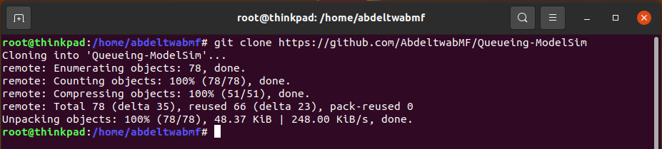
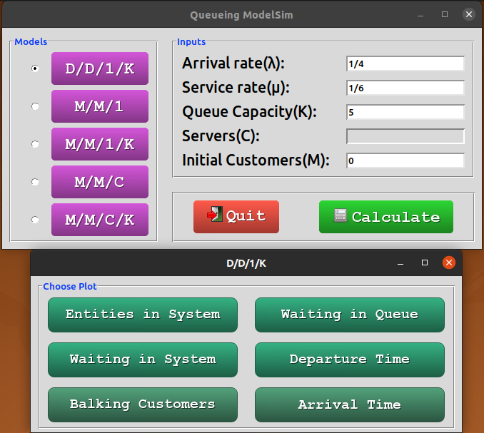
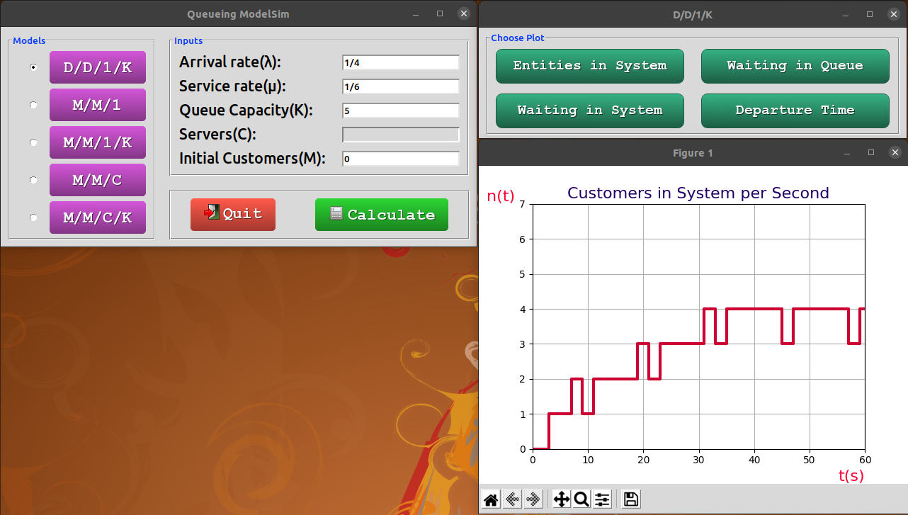
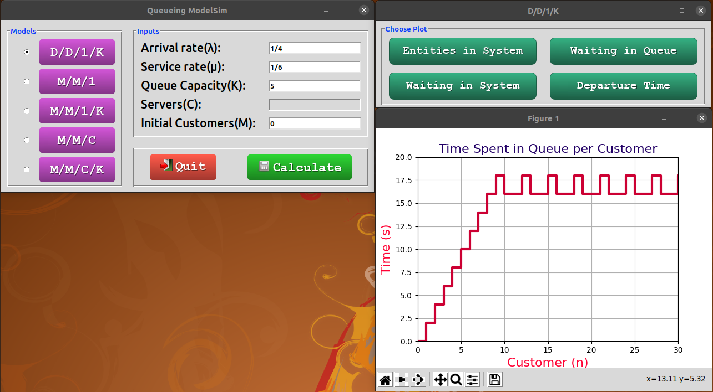

# Queueing ModelSim

It is the software created for the calculation of characteristics of different queues having the BMAP (batch Markovian Arrival Process) as input, and the deterministic queues which characterized by units of input (i.e. customers) arrive at known points in time and the service times are fixed intervals.

## About Queueing Theory

### Definition

Queueing theory is a powerful tool to analyze the daily phenomenon of waiting in line. Discover how to define queueing theory, how it started, why it’s important, and how it can be applied to real-life situations.  

Typical examples might be:

 - banks/supermarkets - waiting for service
 - computers - waiting for a response
 - public transport - waiting for a train or a bus

### Different types of Queueing Systems

Also know as Kendall's Notation as `A/B/C/D/E`, where:

A represents the probability distribution for the arrival process
B represents the probability distribution for the service process
C represents the number of channels (servers)
D represents the maximum number of customers allowed in the queueing system (either being served or waiting for service)
E represents the maximum number of customers in total
Common options for A and B are:

M for a Poisson arrival distribution (exponential inter-arrival distribution) or a exponential service time distribution
D for a deterministic or constant value
G for a general distribution (but with a known mean and variance)
If D and E are not specified then it is assumed that they are infinite.

It is common to use the symbols:

 - λ to be the mean arrival rate.
 - µ to be the mean service rate.

# What it does and How to use it

---

### prerequisite libraries
sudo apt install python3
sudo apt install python3-pip

- sudo pip3 install tk
- sudo pip3 install matplotlib

---

1. Download the repository, or Clone it using the following command: `git clone https://github.com/AbdeltwabMF/Queueing-ModelSim` as shown in figure below.

---

2. Open the `Queueing-ModelSim` directory, and then open `src` directory, then Run `python3 main.py` as shown in the following figure.

  - Choose the queueing model you want to calculate. `D/D/1/K`, `M/M/1`, `M/M/1/K`, `M/M/C`, or `M/M/C/K`
  - Choose the arrival rate (λ) and service rates (µ).
  - Then choose  the number of servers in your system (C), in case of models (`M/M/C` or `M/M/C/K`), the maximum number of entities (aka. Customers) that your queue can hold (K), in case of models (`D/D/1/K`, `M/M/1/K`, or `M/M/C/K`), and the number of initial entities in the system(M) in case of model (`D/D/1/K`). 
  - Press Calculate. 

---

3. In case of Deterministic Queues AKA, `D/D/1/K` a small window will popup asked you to choose which data you want to plot as shown below.

  

---

## The following figures will show the whole plots out. 

  - Firstly: the following figure shows The number of entities (aka. Customers) in the System at each unit of time. 
    
---
   - Secondly: the following figure shows The Time that Customer n needs to spend in the queue to be served.
      
---
   - Thirdly: the following figure shows The Time that Customer n needs to spend in the System till departure.
      
---
   - Fourthly: the following figure shows the time of departure of each entity (aka. Customer).
      
---
   - Fifthly: the following figure shows the Customer who is balked and corresponding time to the process.
      
---
   - Lastly: the following figure shows the arrival time of each entity.
      
---

  - Other than that which is Stochastic Models a small window will popup and you will get the answers for server utilization (rho), Average entities in the whole system (L), Average entities in queue (Lq), Average time an entity spends in the system (W), Average time an entity waits in line to be served (Wq).
    
---

## License
Licensed under the [GPL-3.0 License](LICENSE.md)
